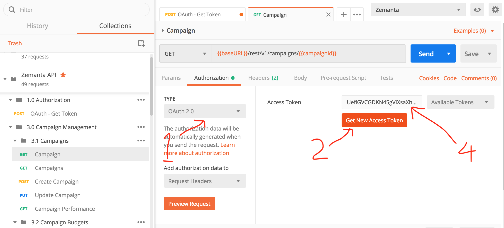
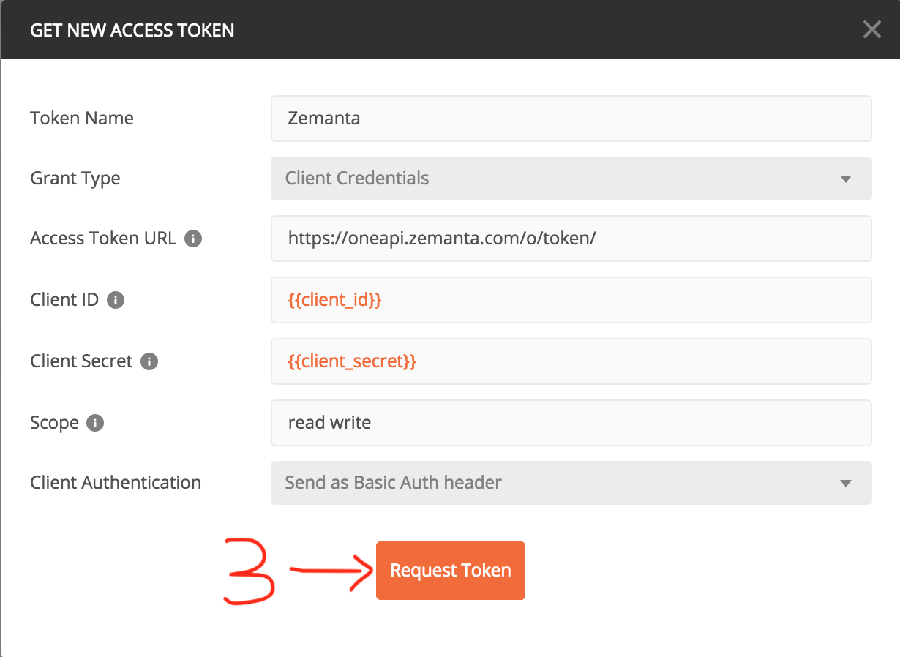
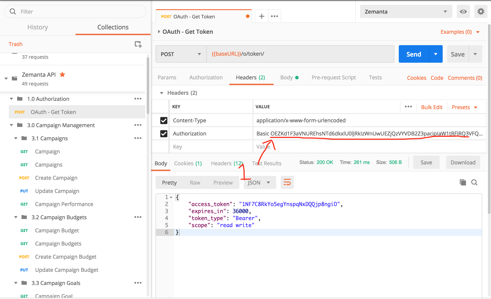
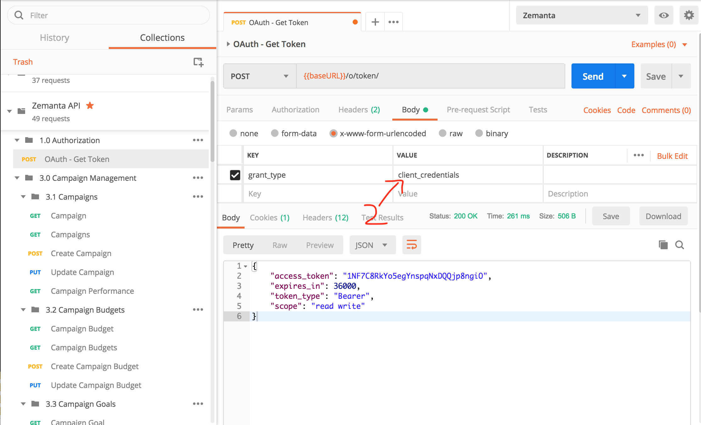
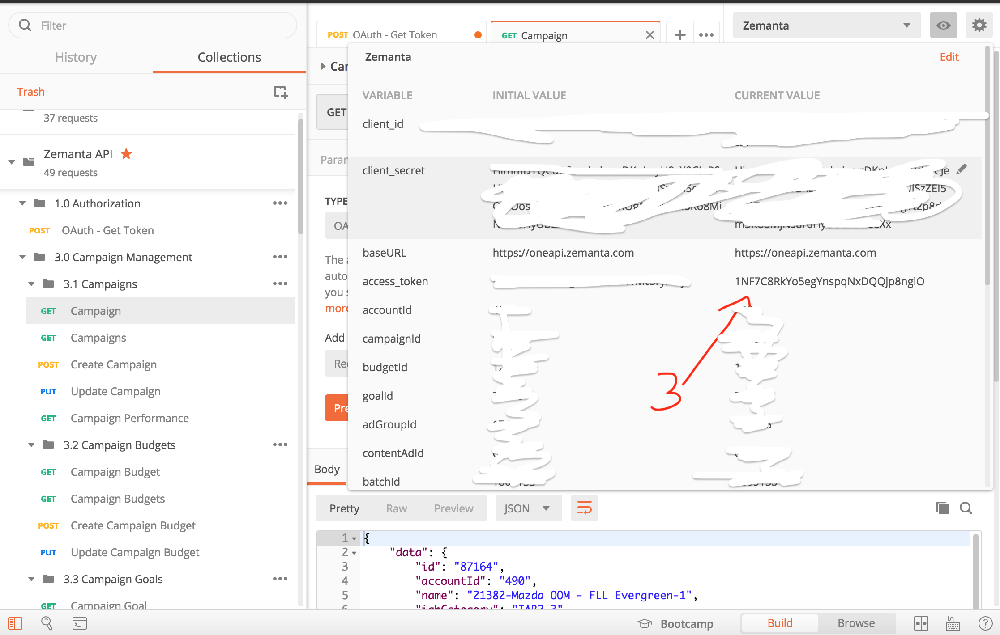

[](https://app.getpostman.com/run-collection/4c180005c95b7e14e515#?env%5BZemanta-ENV%20empty%5D=W3sidHlwZSI6InRleHQiLCJlbmFibGVkIjp0cnVlLCJrZXkiOiJjbGllbnRfaWQiLCJ2YWx1ZSI6IiJ9LHsidHlwZSI6InRleHQiLCJlbmFibGVkIjp0cnVlLCJrZXkiOiJjbGllbnRfc2VjcmV0IiwidmFsdWUiOiIifSx7InR5cGUiOiJ0ZXh0IiwiZW5hYmxlZCI6dHJ1ZSwia2V5IjoiYmFzZVVSTCIsInZhbHVlIjoiaHR0cHM6Ly9vbmVhcGkuemVtYW50YS5jb20ifSx7InR5cGUiOiJ0ZXh0IiwiZW5hYmxlZCI6dHJ1ZSwia2V5IjoiYWNjb3VudElkIiwidmFsdWUiOiIifSx7InR5cGUiOiJ0ZXh0IiwiZW5hYmxlZCI6dHJ1ZSwia2V5IjoiY2FtcGFpZ25JZCIsInZhbHVlIjoiIn0seyJ0eXBlIjoidGV4dCIsImVuYWJsZWQiOnRydWUsImtleSI6ImJ1ZGdldElkIiwidmFsdWUiOiIifSx7InR5cGUiOiJ0ZXh0IiwiZW5hYmxlZCI6dHJ1ZSwia2V5IjoiZ29hbElkIiwidmFsdWUiOiIifSx7InR5cGUiOiJ0ZXh0IiwiZW5hYmxlZCI6dHJ1ZSwia2V5IjoiYWRHcm91cElkIiwidmFsdWUiOiIifSx7InR5cGUiOiJ0ZXh0IiwiZW5hYmxlZCI6dHJ1ZSwia2V5IjoiYmF0Y2hJZCIsInZhbHVlIjoiIn0seyJ0eXBlIjoidGV4dCIsImVuYWJsZWQiOnRydWUsImtleSI6ImNvbnRlbnRBZElkIiwidmFsdWUiOiIifSx7InR5cGUiOiJ0ZXh0IiwiZW5hYmxlZCI6dHJ1ZSwia2V5IjoicHVibGlzaGVyR3JvdXBJZCIsInZhbHVlIjoiIn0seyJ0eXBlIjoidGV4dCIsImVuYWJsZWQiOnRydWUsImtleSI6ImVudHJ5SWQiLCJ2YWx1ZSI6IiJ9LHsidHlwZSI6InRleHQiLCJlbmFibGVkIjp0cnVlLCJrZXkiOiJmcm9tIiwidmFsdWUiOiIifSx7InR5cGUiOiJ0ZXh0IiwiZW5hYmxlZCI6dHJ1ZSwia2V5IjoidG8iLCJ2YWx1ZSI6IiJ9LHsidHlwZSI6InRleHQiLCJlbmFibGVkIjp0cnVlLCJrZXkiOiJqb2JJZCIsInZhbHVlIjoiIn1d)

As Zemanta One API uses OAuth 2, you have two options to use this collection

1. Select Authorization OAuth 2.0 and set your {access_token} (Recommand)

1.1 Select OAuth2.0, Click `Get New Access Token`, select the token generated in step 3 
1.2 

2. Request {access_token} then set `Authorization Bearer {access_token}` accross every API request.
2.1 set `Authorization Basic base64({client_id}:{client_secret})` to Authorization, you can get base64 value via [链接文字](链接地址 标题) 

2.2 select `application/x-www-form-urlencoded` as Content-Type, set grant_type=client_credentials

2.3 update `access_token` in environment then you're all set.

See also [Zemanta Authorization](http://dev.zemanta.com/one/api/#header-authentication)

For developer convenience, you could define environment variables as I do, or just replace {{variable}} with your own static variable.

See [Zemanta-ENV](./ZEMANTA-ENV.jpg)

## Useful Resources

Never used Postman or the Zemanta One API before? Here's some useful links to get you started and to get help when you have questions or run into problems. <3

#### Zemanta One API

- [Zemanta Help](http://help.zemanta.com/container/show/getting-started)

- [Zemanta One API](http://dev.zemanta.com/one/api/)

#### Postman

- [Download Postman](https://www.getpostman.com/postman)

- [Postman Collection Docs](https://www.getpostman.com/docs/postman/collections/managing_collections)

- [Postman Environment Docs](https://www.getpostman.com/docs/postman/environments_and_globals/manage_environments)

- [Postman Scripting Docs](https://www.getpostman.com/docs/postman/scripts/intro_to_scripts)

- [Postman Scripting API Reference](https://www.getpostman.com/docs/postman/scripts/postman_sandbox_api_reference)
